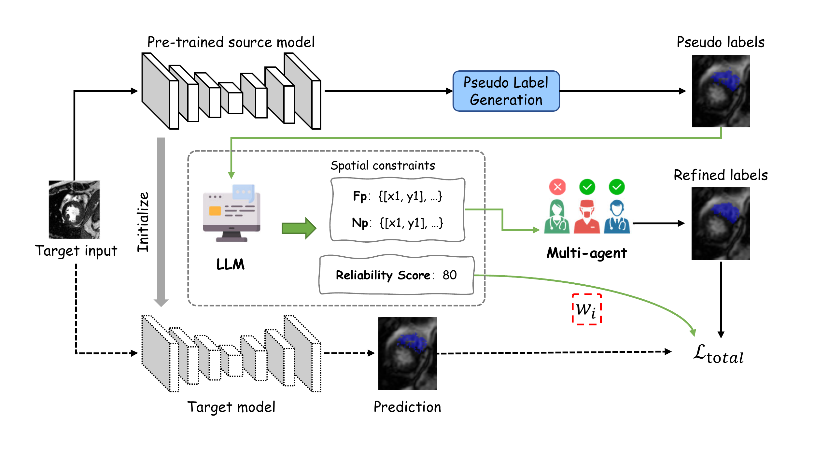

# RaMA: Reliability-Aware Multi-Agent Adaptation

This is the official PyTorch implementation of the MICCAI 2026 paper
**"Source-Free Domain Adaptation for Medical Image Segmentation via
LLM-Agent Collaboration"**.

RaMA integrates a Multimodal LLM as a *Cognitive Meta-Controller* that
performs semantic error checking and generates spatial constraints, which
guide a heterogeneous Multi-Agent System of SAM variants (SAM 3, MedSAM 2,
SAM-Med2D) to produce consensus-refined pseudo-labels. An LLM-derived
reliability score dynamically weights the self-training loss, suppressing
noisy corrections from propagating.

<p align="center">
  
</p>

> **Figure**: Overview of the RaMA framework. The source model initializes the
> target model and produces pseudo labels on unlabeled target images. A
> multimodal LLM converts pseudo-label errors into spatial constraints and a
> reliability score, which guide heterogeneous SAM agents to generate refined
> labels. The refined labels and reliability weight jointly supervise
> reliability-aware target-domain adaptation.


## Requirements

```bash
python3 -m pip install -r requirements.txt
```

Tested with: Python 3.10, PyTorch 2.0+, CUDA 11.8+, single NVIDIA RTX 3090 / 5060 Ti.

### External model code

The three SAM agents are large third-party libraries with their own
checkpoints. Clone them into an `external/` directory and add it to
`PYTHONPATH`:

```bash
mkdir -p external && cd external
# 1. SAM 3 (Meta) — gated on HuggingFace, see https://huggingface.co/facebook/sam3
git clone https://github.com/facebookresearch/sam3.git
# 2. MedSAM 2 — https://github.com/bowang-lab/MedSAM2
git clone https://github.com/bowang-lab/MedSAM2.git
# 3. SAM-Med2D — https://github.com/OpenGVLab/SAM-Med2D
git clone https://github.com/OpenGVLab/SAM-Med2D.git
cd ..

export PYTHONPATH="$PWD/external/sam3:$PWD/external/MedSAM2:$PWD/external/SAM-Med2D:$PYTHONPATH"
```

Download the model checkpoints to `weights/`:

| Model | File | Source |
|---|---|---|
| SAM 3 | `sam3.pt` (3.4 GB) | <https://huggingface.co/facebook/sam3> |
| MedSAM 2 | `MedSAM2_latest.pt` (150 MB) | <https://huggingface.co/wanglab/MedSAM2> |
| SAM-Med2D | `sam-med2d_b.pth` (2.4 GB) | <https://github.com/OpenGVLab/SAM-Med2D> |
| ResNet-34 (ImageNet) | `resnet34-333f7ec4.pth` (83 MB) | torchvision (auto) |

### Configuration

Copy the example config and fill in your local paths and API key:

```bash
cp configs/rama_config.example.yaml configs/rama_config.yaml
```

Or use environment variables:

```bash
export RAMA_WORKSPACE_ROOT=/path/to/workspace
export RAMA_LLM_API_KEY=sk-xxxx                  # Qwen-VL / OpenAI-compatible
export RAMA_SAM3_CKPT=$PWD/weights/sam3.pt
```

## Usage

### 1. Prepare the M&Ms dataset

Download the M&Ms dataset from <http://www.ub.edu/mnms> and convert the NIfTI
volumes to per-slice PNG layout:

```bash
python scripts/prepare_mnms_png.py \
    --raw-root /path/to/MnM \
    --out-root /path/to/processed/mnms_png
```

### 2. Train the source model on Vendor A

```bash
cd src
python train_source.py \
    --Source_Dataset vendorA \
    --num_epochs 400 --batch_size 8 \
    --optimizer SGD --lr 1e-3 --weight_decay 0.0005 --momentum 0.99 \
    --lr_scheduler Epoch \
    --dataset_root /path/to/processed/mnms_png \
    --path_save_log ../repro_training/source_logs \
    --path_save_model ../repro_training/source_models \
    --device cuda:0
```

The checkpoint will be saved to `repro_training/source_models/vendorA/last-Res_Unet.pth`.

### 3. Generate ASGA pseudo-labels (LLM scoring → multi-SAM refinement)

For each target vendor:

```bash
# (a) Source-model inference to produce initial pseudo-labels
python scripts/source_infer.py --vendor vendorB --split train \
    --model-path repro_training/source_models/vendorA/last-Res_Unet.pth \
    --out-dir repro_training/source_preds/vendorB

# (b) LLM scoring + FP/FN point generation
python scripts/llm_score.py --vendor vendorB --split train

# (c) Multi-SAM consensus refinement
python scripts/sam_refine.py --vendor vendorB --split train
```

Refined pseudo-labels are written to `<workspace>/asga/result/{vendor}/{image,mask}`.

### 4. Target adaptation (Round 0 + Rounds 1–3)

```bash
# Round 0: target fine-tuning on refined pseudo-labels with LLM-score weighting
python scripts/finetune_target.py \
    --Source_Dataset vendorA --Target_Dataset vendorB \
    --model_path repro_training/source_models/vendorA/last-Res_Unet.pth \
    --result_root /path/to/asga/result \
    --num_epochs 50 --lr 4e-5 --warmup_epochs 4 \
    --device cuda:0

# Rounds 1-3: iterative self-training (DBSCAN ROI + confidence filtering)
for r in 1 2 3; do
    python scripts/self_train.py --target-dataset vendorB --round $r \
        --round0-log-root repro_training/round0_logs/finetune_ASGA \
        --device cuda:0
done
```

## Results

| Target | Source Only | LLM + Multi-SAM Direct | RaMA |
|---|---:|---:|---:|
| Vendor B | 79.30 | 77.63 | **85.68** |
| Vendor C | 68.58 | 67.79 | **82.13** |
| Vendor D | 75.07 | 75.67 | **80.58** |
| **Mean Dice** | 74.32 | 73.70 | **82.80** |

See `docs/reproduction.md` for full per-class Dice / ASSD, standard deviations,
and detailed training logs.

## Citation

```bibtex
@inproceedings{zhang2026rama,
  title={Source-Free Domain Adaptation for Medical Image Segmentation via
         LLM-Agent Collaboration},
  author={...},
  booktitle={MICCAI},
  year={2026}
}
```

## Acknowledgements

This work builds upon several excellent open-source projects:

- [IPLC](https://github.com/HiLab-git/IPLC) (the SFDA backbone we extend)
- [SAM 3](https://github.com/facebookresearch/sam3) — Meta AI
- [MedSAM 2](https://github.com/bowang-lab/MedSAM2)
- [SAM-Med2D](https://github.com/OpenGVLab/SAM-Med2D)
- [Qwen-VL](https://github.com/QwenLM/Qwen-VL)
